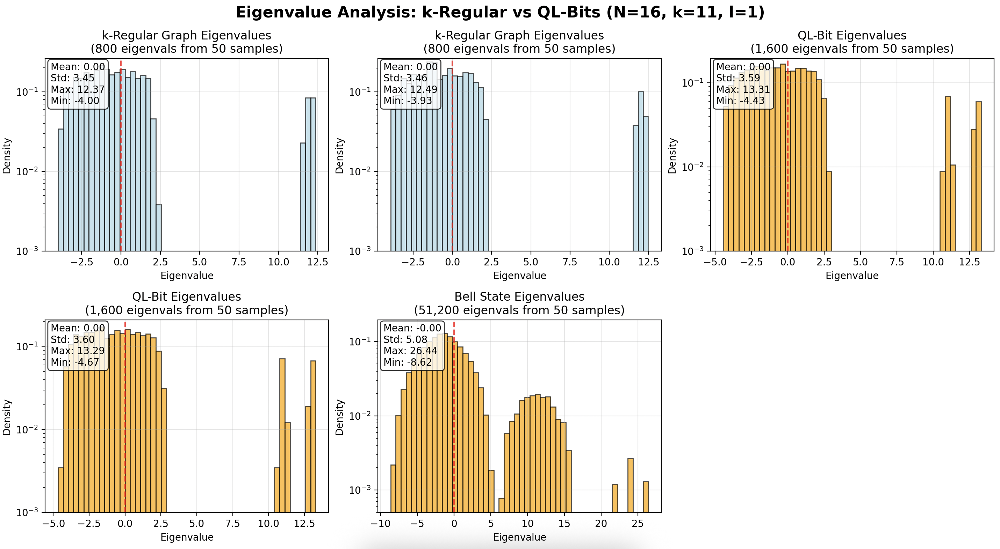

# Quantum-like bits

Research software code to replicate results of emergent state generation in QL-bits from the following paper:

**Quantum information with quantumlike bits** ([10.1103/PhysRevA.111.062203](https://journals.aps.org/pra/pdf/10.1103/PhysRevA.111.062203)).

## Installation

After cloning the repo, just run

```bash
cd quantum-like-bits
pip install . 
```

The focus of the repo is to generate the Bell state eigenvalue distribution of Fig. 4 in the above paper. Replicating the results can be done by running the following `sample_eigenvalue_distributions` method from the `bell_state_generation` module.

```python

from bell_state_generation import sample_eigenvalue_distributions

# Generate a bell state with QL-bit k-regular subgraphs defined on N nodes.
# Coupling between QL-bits defined by l edges per node.
N = 16
k = 11
l = 1
M = 50  # Number of samples

# Sample and plot distributions
sample_eigenvalue_distributions(N, k, l, M)
```

The resulting figure should look like the following.


